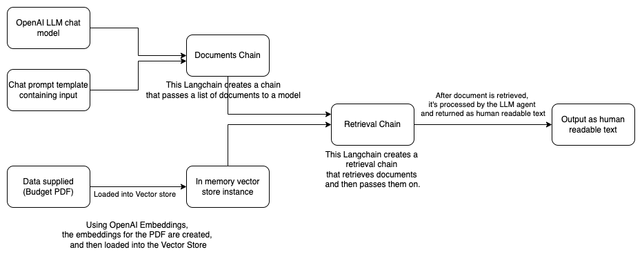

# QA bot with Langchain

## Architecture:
- Platform: Node.js
- GPT model: OpenAI gpt-3.5
- Embeddings: OpenAI Embeddings
- Vector store: Node in-memory vectore store

  Basic diagram explaining the architecture and working of this langchain
  

## Setup Prerequities
- Node.js 18+
- OpenAI API key

  Paste the OpenAI API ket in the `OPENAI_API_KEY` variable in `.env` file.

## Installation
- Clone repository

  `git clone https://github.com/gaganshera/qa_bot_langchain.git`

- Go to the directory

  `cd qa_bot_langchain`

- Install dependencies

  `npm i`

- Run

  `node chat`

## Demo recording
  
  <video src="./chat_recording.mov"/>
